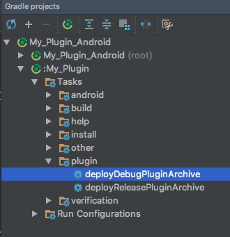

## How to use
1. Build plugin with "deployDebugPluginArchive" task

2. Open unity project and the script is at `Plugins\My Plugin\MyPlugin.cs`

References
[**Unity Android Plugin Tutorial 2.**](http://eppz.eu/blog/unity-android-plugin-tutorial-2/)